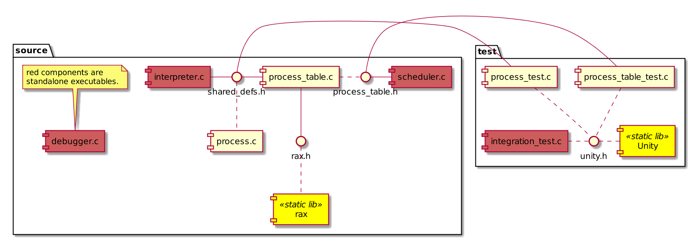

#  An userland process scheduler

*
 Luiz Carlos Rumbelsperger Viana.
*

This project implements an userland process scheduler.
It is not meant for any serious production use, but rather to illustrate the usage of unix system calls for multiprogramming and the construction of encapsulated abstract data types in C. The code is well documented enough to serve as a basis for a tutorial application. It is intended primarily for academic purposes.

- [An userland process scheduler](#an-userland-process-scheduler)
  - [The code](#the-code)
    - [Main source code](#main-source-code)
      - [Interface modules](#interface-modules)
      - [Implementation modules](#implementation-modules)
    - [Test code](#test-code)
      - [Implementation modules](#implementation-modules-1)
    - [Dependencies](#dependencies)
    - [Full structure diagram](#full-structure-diagram)
  - [Building and Testing](#building-and-testing)
  - [License](#license)

## The code

### Main source code

The structure of the [main source code](src) of the project is divided into:

#### Interface modules

- `shared_defs.h`
- `process_table.h`

#### Implementation modules

- `process.c`
- `process_table.c`
- `scheduler.c`
- `interpreter.c`
- `debugger.c`

### Test code

#### Implementation modules

- `process_table_test.c`
- `process_test.c`
- `integration_test.c`

### Dependencies

- [rax](https://github.com/antirez/rax.git)
- [Unity](https://github.com/ThrowTheSwitch/Unity.git)
- [premake5](https://premake.github.io/)

See [dependencies.md](dependencies.md) for details.

### Full structure diagram

## Building and Testing

For building the release version just run `make` and then execute each generated test executable under build/bin/Debug.

The makefiles are automatically generated from the premake5 script, so it is also theoretically possible, but untested, to compile them using Xcode.

## License

This project is released under the [MIT](https://opensource.org/licenses/MIT) license.

For more information, see [license](LICENSE.md).

